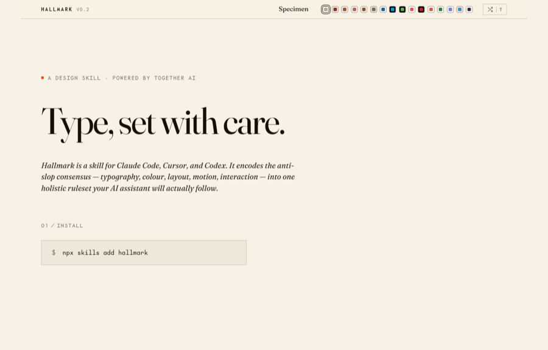
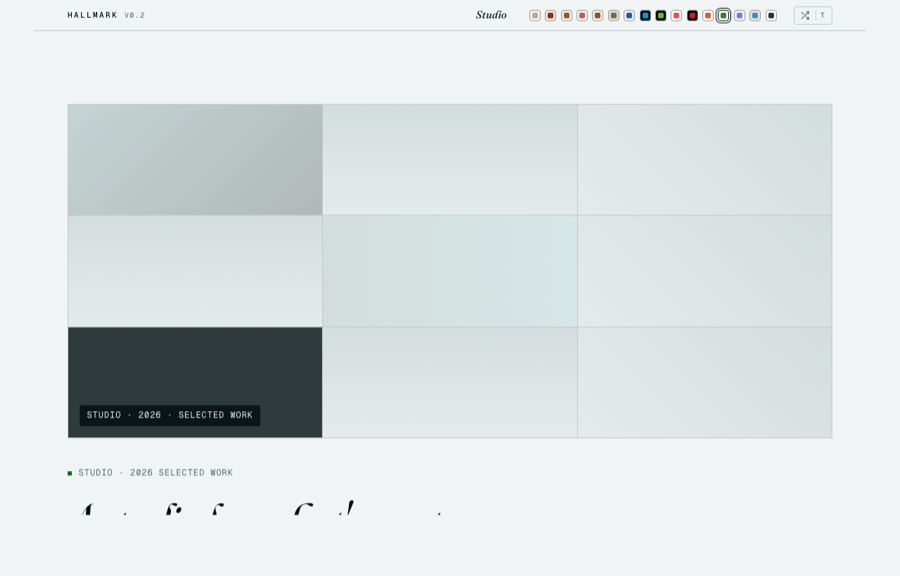
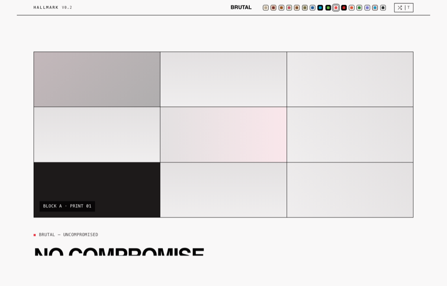
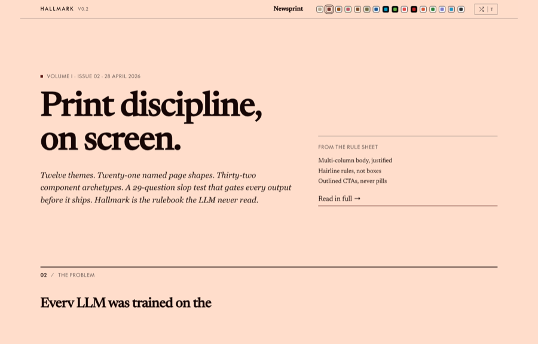

# Hallmark

**A design skill that studies what you admire — and rebuilds your content with it.**

→ Live demo: **[hallmark-murex.vercel.app](https://hallmark-murex.vercel.app)** · sixteen themes, eight worked tests, press `T` to cycle.
→ Current version: **v0.7.0** — adds the `custom` theme route (catalog stays the default; custom fires only when the brief signals it).

<table>
  <tr>
    <td></td>
    <td></td>
  </tr>
  <tr>
    <td></td>
    <td></td>
  </tr>
</table>

Hallmark is the **anti-AI-slop** rule-set for Claude Code, Cursor, and Codex. It encodes the [tactile-rebellion](https://www.creativebloq.com/design/graphic-design/texture-warmth-and-tactile-rebellion-the-big-graphic-design-trends-for-2026) consensus — typography, colour, layout, motion, microinteractions, structural variety — into one opinionated skill that refuses to emit the on-distribution defaults every LLM was trained into.

Powered by Together AI.

---

## Try it

Paste this into Claude Code, Cursor, or Codex with the Hallmark skill installed:

> *"Build me a landing page for Coffeebox — a small-batch coffee subscription. Roast on Sunday, ship on Monday, drink Tuesday. Audience: people who already buy good coffee. Tone: warm, hand-set, editorial."*

If Hallmark is wired correctly, you'll see Long Document · Linen (warm-paper roman-serif) · Tier-B hand-built SVG. Eight more worked briefs are documented in [`recipes.md`](skill/references/recipes.md) — copy/paste them to discover the skill before reading anything else.

---

## What's distinct — quick map vs the field

|  | Hallmark | [frontend-design](https://github.com/anthropics/skills) (Anthropic) | [Open Design](https://github.com/nexu-io/open-design) | [Dembrandt](https://github.com/dembrandt/dembrandt) |
| --- | --- | --- | --- | --- |
| **Source of taste** | extracts DNA from a screenshot you admire (`study` verb) | art-director brief + ban list | menu of 72 brand presets (Linear, Stripe, Vercel, Notion…) | scrapes a live URL, emits computed tokens |
| **Output unit** | macrostructure + theme + custom-craft | bans + brief framing | preset application | DTCG `tokens.json` |
| **Refuses font ID** | yes — names role, never guesses | n/a | n/a | n/a (computes from CSS) |
| **Refuses pixel-clone** | yes — DNA only, never pixels | n/a | n/a | n/a (full token export) |
| **Tactile-rebellion alignment** | warm-paper, custom-craft, slopless canon | strong | medium | none — token-only |
| **Pages by archetype** | 21 named macrostructures, picked per brief | by brief | 5 deterministic directions | n/a |
| **Verbs** | 5 (default · `audit` · `refine` · `redesign` · `study`) | 1 | 31 | 1 (CLI) |

Hallmark's edge is **`study`** — every other tool ships a preset menu or a scraper. Hallmark is the only one that takes a screenshot of a design you admire, names what it sees, refuses paid-template-marketplace listings, and rebuilds your content with the extracted DNA. Three worked study examples in [`study-examples.md`](skill/references/study-examples.md).

---

## Five verbs

| Verb | What it does |
| --- | --- |
| *(default)* | Build new UI. Asks for audience + use + tone (skippable — the skill states what it inferred). Picks a macrostructure, applies the rule-set, runs the slop test before handing back. |
| `hallmark audit <target>` | Score existing code against the named anti-patterns + structural sameness. Punch list, no edits. |
| `hallmark refine <target>` | Polish in place. Smallest possible diff. Preserves structure. |
| `hallmark redesign <target> [--mood <name>]` | Throw out the structure, keep copy + IA + brand, rebuild with a deliberately different fingerprint. |
| **`hallmark study <screenshot>`** | The differentiator. Extract the **DNA** from a design the user admires — macrostructure, archetypes, type-pairing role, colour anchor — and produce a diagnosis report. Optionally rebuild *the user's* content using the extracted DNA. **Refuses paid templates and competitor pages. Names font roles, never font IDs. Never copies pixels.** |

---

## Eight pages, eight different shapes

Generated by exercising the skill across contrasting briefs. No two share a macrostructure or theme.

<table>
  <tr>
    <td width="25%"></td>
    <td width="25%"></td>
    <td width="25%"></td>
    <td width="25%"></td>
  </tr>
  <tr>
    <td><b>Tide</b><br/><sub>Quote-Led · Atelier · indie podcast</sub></td>
    <td><b>Streampipe</b><br/><sub>Workbench · Terminal · CSS-art mockup</sub></td>
    <td><b>Maple Street Bread</b><br/><sub>Long Doc · Linen · hand-built SVG loaf</sub></td>
    <td><b>Meridian</b><br/><sub>Manifesto · 11-section practice</sub></td>
  </tr>
  <tr>
    <td></td>
    <td></td>
    <td></td>
    <td></td>
  </tr>
  <tr>
    <td><b>Tracejam</b><br/><sub>Bento · Pastel · clipped-edge mockup</sub></td>
    <td><b>Anya</b><br/><sub>Long Doc · Studio · personal one-pager</sub></td>
    <td><b>Foundry</b><br/><sub>Stat-Led · Plain (#fff) · animated counter</sub></td>
    <td><b>Cohort</b><br/><sub>Marquee Hero · Salon · continuous scroll</sub></td>
  </tr>
</table>

Each page is its own self-contained HTML + CSS — no shared theme, no shared layout. Every one carries a `/* Hallmark · macrostructure: … */` stamp at the top of its CSS. See the full set under [`site/_tests/`](site/_tests/) or live at [hallmark-murex.vercel.app](https://hallmark-murex.vercel.app).

---

## What's inside

- **[`SKILL.md`](skill/SKILL.md)** — the routing file. Six-step design flow (including `Step 2.5 · Check project memory` reading `.hallmark/log.json`), 38-question slop test, output contract.
- **[`references/`](skill/references/)** — eighteen short, opinionated rule files: typography, colour, layout, motion, microinteractions, interaction-and-states, responsive, copy, anti-patterns, the 21 named macrostructures, the 36 component archetypes with variation knobs, the 6 primitive structure axes, the vision-extraction protocol for `study`, hero enrichment, custom-craft (CSS art over Lottie), assets, plus the new **[`recipes.md`](skill/references/recipes.md)** (8 worked briefs + a canonical try-it prompt) and **[`study-examples.md`](skill/references/study-examples.md)** (3 worked DNA-extractions).
- **[`site/`](site/)** — a self-demonstrating landing page. Hand-written HTML + CSS + ES module, no framework, no build step. **Sixteen themes** balanced across the warm / cool / neutral spectrum: warm-paper (Specimen, Atelier, Newsprint, Salon, Riso), cool-paper (Linen-cool-slate, Studio-cool-grey, Garden, Almanac, Pastel, Sport), neutral (Brutal, Quiet), dark (Midnight, Terminal, Manifesto). Switching themes literally rebuilds the page — different hero archetype, different footer archetype.

---

## What's distinct (the long list)

- **One skill, five verbs.** Not eighteen commands.
- **Tone is a first-class decision.** "Clean and modern" is rejected. Pick an extreme — *editorial · brutalist · soft · technical · luxury · playful · austere*.
- **Macrostructures over axes.** Pick one of 21 named whole-page shapes wholesale; the macrostructure stamp lives in the CSS comment, so the next Hallmark run picks something different.
- **Within-archetype variation.** Two Bento Grids should not be twins; each archetype has 2–3 picked-per-output knobs.
- **Microinteractions as discipline.** Silent success over celebratory toasts. Optimistic update + Undo over confirm dialogs. Hover delay 800 ms, focus delay 0 ms.
- **A 38-gate slop test** runs before every output. One yes fails the build. Recent additions: no horizontal scroll between 320–1920 px (gate 36), decorative effects on text must be visually verified to sit at x-height not baseline (gate 37), interactive bars must declare `align-items: center` (gate 38).
- **Project memory.** A per-project `.hallmark/log.json` records each run's macrostructure + theme + enrichment + brief summary. The skill reads the last 3–5 entries before picking and writes a new entry after each build, so consecutive Hallmark outputs in the same project don't repeat shapes or themes.
- **Theme-diversification rule.** Two consecutive themes must differ on at least one of three axes: paper band (dark / mid / light), display style (italic-serif / roman-serif / geometric-sans / mono / display-heavy / system-native), accent hue (warm / cool / neutral / chromatic-other).
- **Voice fixtures over LLM defaults.** Each of the 21 macrostructures ships with 2–3 example opening lines from real designer-engineer sites (Pentagram, Klim, Linear, Are.na, Resend, Lynn Fisher, Rauno Freiberg…). "Built for the modern team" is in the banned-phrases list.
- **Hero enrichment is opt-in.** A typographic-only hero is always acceptable. When enrichment is right, the skill picks from a six-tier hierarchy: typography only → custom-built CSS art → hand-built SVG → generated illustration (Nanobanana / Recraft) → library → Lottie (last resort).
- **Microinteractions default-on for SaaS-shaped archetypes.** Bento Grid, Stat-Led, Workbench, Marquee Hero pages ship with 2–3 purposeful microinteractions (number reveal, pricing lift, marquee, stagger) without the user having to ask. Editorial / Manifesto / Letter / Quote-Led pages stay still.
- **SaaS page sequence.** Hero → social proof → features → testimonials → pricing → FAQ → CTA → footer. Real prices, not "contact sales for pricing." Specific testimonials with role + company.
- **Wordmark may use a different display face.** A Geist-bodied SaaS page can set its wordmark in Fraunces. Same-family collapse on Bento / Stat-Led / Workbench / Marquee Hero is the new "un-branded" tell.
- **`study` extracts DNA, not pixels.** Refusal heuristics, type-role vocabulary (no font ID guessing), confirmation step before any code. Three worked examples in [`study-examples.md`](skill/references/study-examples.md).

---

## Install

```
npx skills add hallmark
```

Or copy [`skill/`](skill/) into `~/.claude/skills/hallmark/` (Claude Code) or `.cursor/rules/hallmark.mdc` (Cursor — body of `SKILL.md`, no frontmatter).

To preview the landing page locally:

```
cd site && python3 -m http.server 4173    # → http://localhost:4173
```

Press `T` to cycle themes, the **shuffle button** (or `R`) to randomise, `?theme=studio` for a shareable link.

Or visit the live deploy at **[hallmark-murex.vercel.app](https://hallmark-murex.vercel.app)**.

---

## Credits

Built on the open work of:

- Paul Bakaus' [**impeccable**](https://github.com/pbakaus/impeccable) — the named-tells canon
- tw93's [**kami**](https://github.com/tw93/kami) — the slop-test concept and 20-question scoring
- Leonxlnx's [**taste-skill**](https://github.com/Leonxlnx/taste-skill) — taste vocabulary and the audit verb
- Anthropic's [**frontend-design**](https://github.com/anthropics/skills) and [**canvas-design**](https://github.com/anthropics/skills) skills — the design-context-gate pattern
- nexu-io's [**Open Design**](https://github.com/nexu-io/open-design) — the deterministic anti-AI-slop checklist; convergent inspiration for several gates
- [**Dembrandt**](https://github.com/dembrandt/dembrandt) — DTCG token-export pattern (informed Tier-2 roadmap; not yet implemented in Hallmark)
- Google Stitch's [**DESIGN.md**](https://getdesign.md) — single-source design docs
- Marie Claire Dean's [**63 design skills for Claude**](https://marieclairedean.substack.com/p/i-built-63-design-skills-for-claude) — coverage map
- Steve Barclay's [**PencilPlaybook**](https://github.com/stevembarclay/pencilplaybook) — the design-language playbook format
- The [**Slopless**](https://slopless.design) tactile-rebellion canon — the 2026 anti-AI-perfect movement (informed Studio, Pastel, Riso)
- [925studios' AI Slop Web Design Guide](https://www.925studios.co/blog/ai-slop-web-design-guide) — the canonical slop-tells vocabulary
- Anthropic's [**Skill Engineering**](https://www.anthropic.com/engineering/equipping-agents-for-the-real-world-with-agent-skills) writeup — file budgets, load-on-demand patterns, frontmatter shape

Where rules overlapped, Hallmark adopted. Where they diverged, Hallmark picked.

---

## Licence

MIT. Use it, fork it, ship it.
